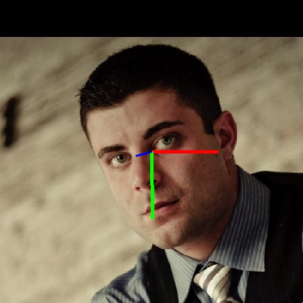

Head Pose Estimation  
==============================

 Head Pose Estimation By using mediapipe and Xgboost

 Originally  we used  [this dataset](http://www.cbsr.ia.ac.cn/users/xiangyuzhu/projects/3DDFA/Database/AFLW2000-3D.zip), we extract from this dataset 3 labels only Yaw-bitch-roll (from mat_s files) and we used mediapipe to cropfaces and also to extract acurate landmarks from images files 


Our Steps
------------
1. Building Dataframe
    
    1. Looping through all images
    2. Croping faces by using FaceDetection  model in mediapipe
    3. resize images to be 300 * 300
    3. Extracting landmarks(X,Y) by using FaceMesh model in mediapipe
    4. Reading corresponding matfile and EXtracting labels from them 


2. Training ML model 

    1. Create preprocess model called normalize_points to center face 
        
        1. Divide all the points by the Subtraction of borow and nose
        2. Subtract all points form nose points(x,y)
    2. Using MultiOutputRegressor with XGBoost model for training
        ```
        MultiOutputRegressor(XGBRegressor(n_estimators=500, max_depth=3, eta=.1, subsample=0.7, colsample_bytree=0.7)))
        ```


3. Building real time env to run model on it   


How to run this app
------------
1. First, clone this repository and open a terminal inside the root folder.

2. Create and activate a new virtual environment (recommended) by running the following:
```
python3 -m venv myvenv
source myvenv/bin/activate
```

3. Install requirements
```
pip install -r requirements.txt
```

4. Change directory to src folder

```
cd src/
```

5. Run the app
```
python main.py
```

6. enjoys using the app and know what is the pose of your head


7. watch a sample video here on my face
[here](https://youtu.be/AsUoQQ1SX4M)



--------

